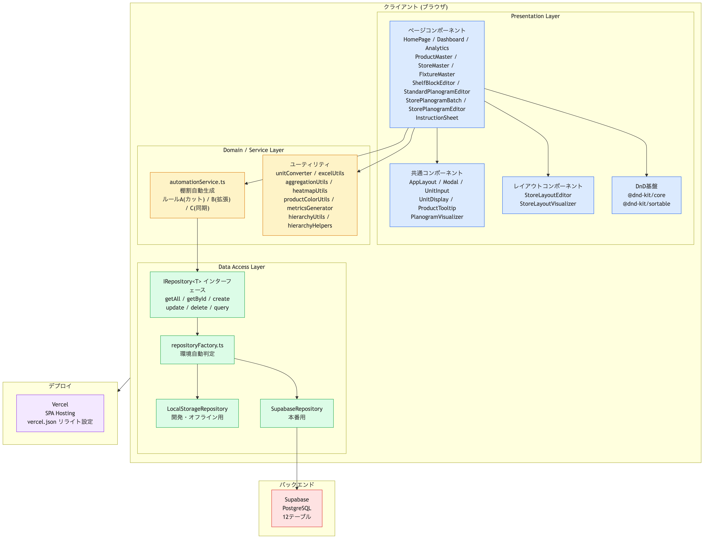

# システム基本設計書 (System Basic Design Document)

**プロジェクト名**: 棚割管理システム (Planogram System) MVP
**作成日**: 2026-01-08

## 1. はじめに

本書は、棚割管理システムMVPの基本設計をまとめたものである。本システムは、FMT（フォーマット）標準棚割の作成と、在庫店ごとの棚サイズに合わせた棚割の自動展開・調整を効率化することを目的とする。

## 2. システム概要

### 2.1 目的
*   標準棚割作成工数の削減（ブロック単位の編集）
*   個店展開業務の自動化（カット・拡張ロジックの適用）
*   棚割調整業務の属人化解消

### 2.2 対象ユーザー
*   本部棚割担当者（FMT標準棚割作成）
*   店舗担当者・SV（個店棚割の確認・微調整）

### 2.3 主要機能
1.  **マスタ管理**: 商品、店舗、什器、店舗什器配置
2.  **棚ブロック管理**: 商品構成のテンプレート化
3.  **標準棚割作成**: ブロック配置による標準パターンの作成
4.  **個店棚割自動生成**: ルールベースによる一括展開
5.  **個店棚割編集**: 自動生成結果の確認と手動調整

## 3. アーキテクチャ構成

将来的なクラウド移行（GCP/Firestore）を見据え、UI層とデータ層を疎結合にするレイヤードアーキテクチャを採用する。

### 3.1 技術スタック
*   **フロントエンド**: React (v18), TypeScript
*   **ビルドツール**: Vite
*   **状態管理/データ永続化**: Custom Hooks + Repository Pattern (LocalStorage)
*   **UI/スタイリング**: Vanilla CSS + CSS Variables (Design System)
*   **ドラッグ＆ドロップ**: @dnd-kit/core

### 3.2 アーキテクチャ図

## 4. データ設計

### 4.1 エンティティ定義 (src/data/types/index.ts)

| エンティティ | 説明 | 主な属性 |
| :--- | :--- | :--- |
| **Product** | 商品情報 | ID, JAN, 名称, サイズ(W/H/D), カテゴリ, 売上ランク |
| **Store** | 店舗情報 | ID, コード, 名称, FMT, 地域 |
| **Fixture** | 什器マスタ | ID, 名称, サイズ(W/H/D), 段数, メーカー |
| **StoreFixturePlacement** | 店舗什器 | ID, 店舗ID, 什器ID, 配置位置(W) |
| **ShelfBlock** | 棚ブロック | ID, 名称, サイズ, 商品配置リスト(相対位置) |
| **StandardPlanogram** | 標準棚割 | ID, FMT, 基準店舗ID, ブロック配置, 商品展開リスト |
| **StorePlanogram** | 個店棚割 | ID, 店舗ID, 標準棚割ID, 商品配置リスト(絶対位置) |

### 4.2 関連図 (ERD概要)

## 5. 機能設計

### 5.1 自動化ロジック (Automation Service)
個店展開時に適用される3つの主要ルールを定義する。

#### ルールA: カット (Cut)
店舗の棚幅が標準棚割より**狭い**場合に発動。
1.  **フェイス削減**: 売上ランクが低い順（数値が大きい順）に、フェイス数を1まで減らす。
2.  **商品カット**: それでも収まらない場合、売上ランクが低い順に商品を棚割から削除する。

#### ルールB: 拡張 (Expand)
店舗の棚幅が標準棚割より**広い**場合に発動。
1.  **トップ商品拡充**: 売上ランク上位10商品のフェイス数を2倍にする。
2.  **準トップ商品拡充**: まだ空きがある場合、上位商品はフェイス数を1.5倍（1個→2個など）にする。
3.  **余白**: それでも埋まらない場合は空白スペースとして残す（棚板を露出）。

#### ルールC: 同期 (Sync)
個店棚割編集画面にて、標準棚割の最新状態を再取得する機能。標準棚割側で商品構成が変わった際、個店のサイズ制約（ルールA/B）を維持しつつ、商品の入れ替えを反映させる。

### 5.2 画面一覧
1.  **ホーム**: ダッシュボード、データ初期化
2.  **マスタ管理**:
    *   商品マスタ（一覧・編集）
    *   棚什器マスタ（一覧・編集）
    *   店舗マスタ（一覧・編集）
    *   店舗棚尺マスタ（什器配置）
3.  **標準棚割管理**:
    *   棚ブロック管理
    *   FMT標準棚割エディタ
4.  **個店棚割管理**:
    *   一括自動生成（バッチUI）
    *   個店棚割詳細エディタ

## 6. UI/UX設計

### 6.1 デザインシステム
*   **カラーパレット**:
    *   Primary: Indigo (#6366f1)
    *   Warning: Amber (#f59e0b) - ランク中位・注意喚起
    *   Danger: Rose (#f43f5e) - ランク下位・削除・エラー
    *   Success: Emerald (#10b981) - ランク上位・正常完了
*   **単位表示**:
    *   システム内部: `cm` で統一管理
    *   UI表示: `120cm (4.0尺)` のようにユーザー慣習に合わせて併記

### 6.2 インタラクション
*   **ドラッグ＆ドロップ**: 商品のブロックへの配置、ブロックの棚への配置に使用。
*   **視覚フィードバック**: ドラッグ中の位置表示、配置不可エリアの表示、空きスペースの警告色（赤ストライプ）。

## 7. 今後の拡張性

本MVPはデータ永続化にLocalStorageを使用しているが、Repositoryパターンによりデータアクセス層が抽象化されている。
`src/data/repositories/baseRepository.ts` の `IRepository` インターフェースを実装する `FirestoreRepository` クラスを作成し、DI（依存性の注入）またはファクトリを切り替えることで、アプリケーションロジックを変更することなくクラウドDBへ移行可能である。

---
以上
