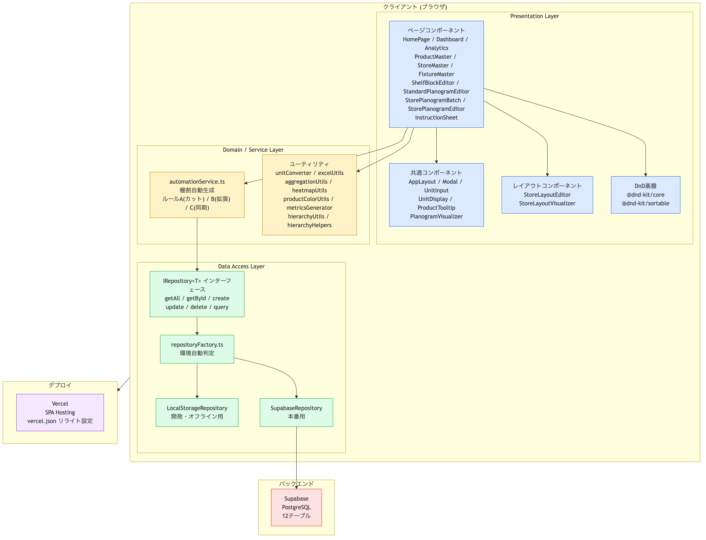

# システムアーキテクチャ設計書 (System Architecture Design)

**作成日**: 2026-01-08 (更新: 2026-01-09)
**プロジェクト**: 棚割管理システム (Planogram System) MVP

## 1. はじめに

本書は、棚割管理システムMVPの技術的なアーキテクチャ、技術スタック、およびシステム構成を定義するものである。
機能的な要件および詳細仕様については、[基本設計書](./basic_design.md)および[詳細設計書](./detailed_design.md)を参照すること。

## 2. システム概要

### 2.1 目的
*   標準棚割作成工数の削減
*   個店展開業務の自動化
*   棚割調整業務の属人化解消

### 2.2 アーキテクチャ構成
将来的なクラウド移行（GCP/Firestore）を見据え、UI層とデータ層を疎結合にするレイヤードアーキテクチャを採用する。

*   **Presentation Layer (UI)**: Reactコンポーネント。ユーザー操作を受け付け、Service層を呼び出す。
*   **Domain/Service Layer**: ビジネスロジック（棚割計算、バリデーション）。
*   **Data Access Layer (Repository)**: データの永続化を担当。現在はLocalStorageを使用するが、将来的にFirestoreへ差し替え可能な設計とする。

### 2.3 技術スタック
*   **フロントエンド**: React (v18), TypeScript
*   **ビルドツール**: Vite
*   **状態管理/データ永続化**: React Custom Hooks + Repository Pattern (LocalStorageベースでのキャッシュと永続化連携)
*   **データ構造可視化**: 複数のCanvas、またはReact Component (+CSS absolute/grid) による2Dレンダリング
*   **UI/スタイリング**: Vanilla CSS + CSS Variables
*   **ドラッグ＆ドロップ（DND）**: `@dnd-kit/core`
*   **ルーティング**: `react-router-dom`

### 2.4 アーキテクチャ図

## 3. データ設計方針

データ永続化層の設計方針。具体的なテーブル定義は[データベース論理設計書](./database_logical_design.md)を参照。

### 3.1 リポジトリパターン
`src/data/repositories/baseRepository.ts` の `IRepository` インターフェースを定義し、具象クラス（`LocalStorageRepository`）で実装する。
これにより、アプリケーションロジックを変更することなく、将来的なバックエンドDB移行（例: `FirestoreRepository`）を容易にする。

### 3.2 エンティティ概要
*   **Product**: 商品基本情報に加え、分析用メトリクスや組織階層属性情報を包含。JANなし（インハウス等）も許容。
*   **Store**: 店舗情報
*   **Fixture**: 什器マスタ（`fixtureType` で機能別分类）
*   **StoreFixturePlacement**: 店舗ごとの什器の平面レイアウト（絶対座標 X, Y、回転方向）を保持。
*   **ShelfBlock**: 商品群（フェイス等）の組み合わせテンプレート設計
*   **StandardPlanogram**: 標準・デフォルトとなる陳列計画や棚割
*   **StorePlanogram**: 個店舗ごとの拡張・カットを経て生成される陳列実態データ

### 3.3 データフロー・設計の分離性
* 什器の物理的な「レイアウト（2D）」と、その中に置かれる「棚割（段と一次元横座標）」は内部で疎結合に実装されている。
* エディタ内でのドラッグ（DND）に伴う座標の変位や判定では、この疎結合な設計をUI上で計算合成することでリアルタイムに反映。

## 4. 今後の拡張性

本MVPはクライアントサイド（LocalStorage）で完結しているが、以下の拡張性を考慮して実装されている。

1.  **データベース移行**: Repositoryパターンの採用により、データソースの差し替えが容易。
2.  **認証機能**: Firebase Auth等の導入を想定し、ユーザーコンテキストを渡しやすいContext設計とする。
3.  **API連携**: 外部システム（基幹システム）からのデータインポートインターフェースの分離。

---
以上
