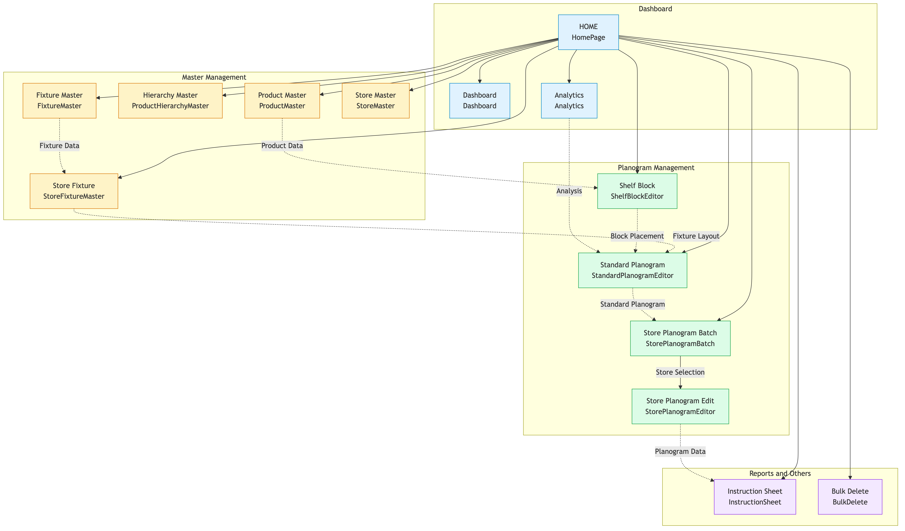
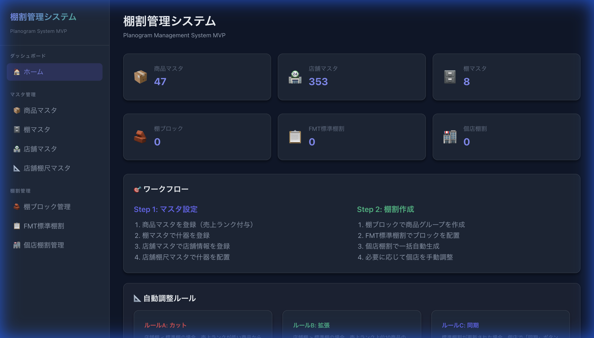
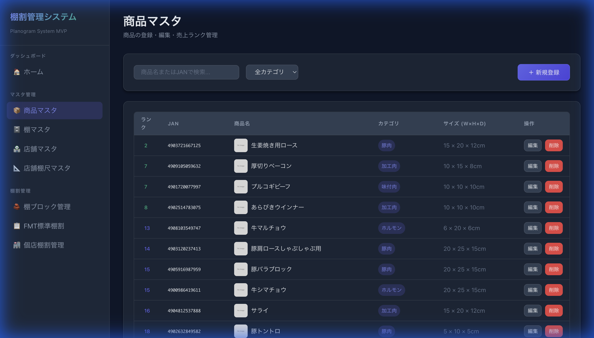
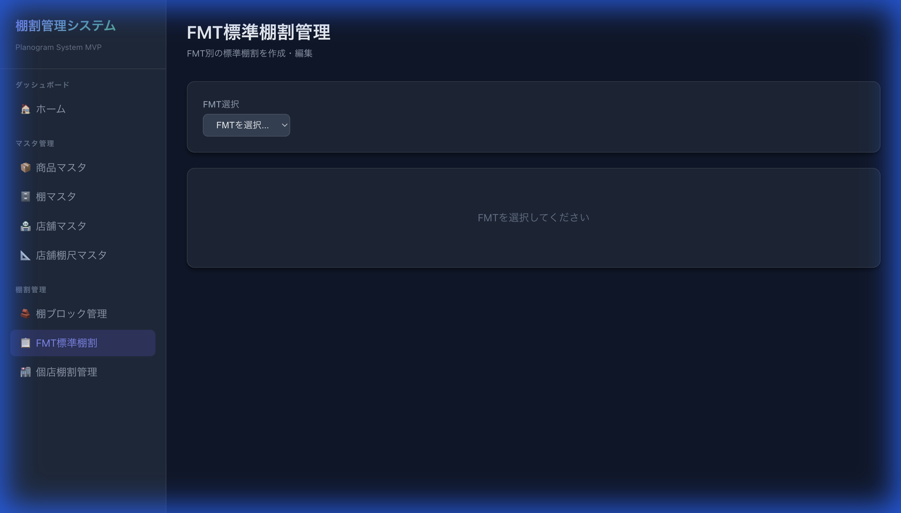
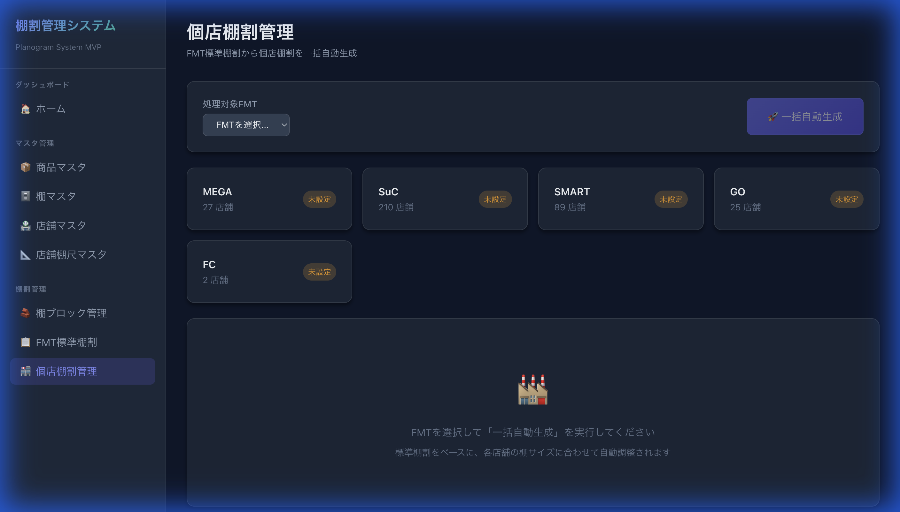

# 画面遷移図 (Visual Screen Transition)

**作成日**: 2026-01-09
**プロジェクト**: 棚割管理システム (Planogram System) MVP

本ドキュメントは、実際のアプリケーション画面キャプチャを用いて画面遷移と機能フローを可視化したものである。

## 1. 全体遷移図 (Overview)

## 2. 画面詳細と遷移フロー (Screen Details)

### 2.1 ホーム画面 (Home / Dashboard)
システムへの入口。現在のマスタ登録状況や棚割作成状況がダッシュボードとして表示される。

*   **遷移先**:
    *   マスタ管理 (商品、店舗、什器)
    *   FMT標準棚割管理
    *   個店棚割管理

---

### 2.2 マスタ管理 (Master Management)
商品、店舗、什器の基礎データを管理する。

#### 商品マスタ一覧 (Product List)
登録済み商品の一覧表示。売上ランクやサイズ情報の確認が可能。

---

### 2.3 標準棚割管理 (Standard Planogram)
本部が作成する「FMT（業態）」ごとの基準棚割。
ブロック（商品セット）をドラッグ＆ドロップで配置して作成する。

---

### 2.4 個店棚割管理 (Store Planogram)
各店舗に展開された棚割。
一括自動生成（Batch Generation）機能により、標準棚割と店舗サイズを元に「カット」または「拡張」ロジックが適用される。

