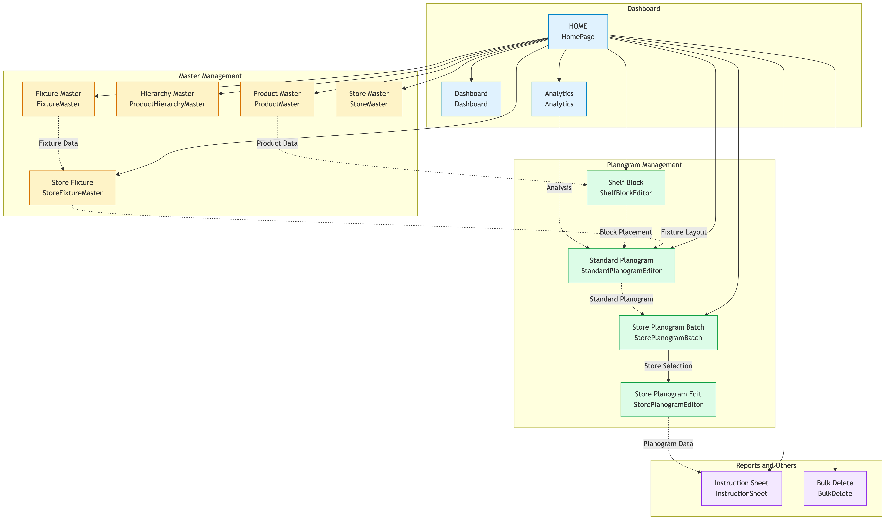
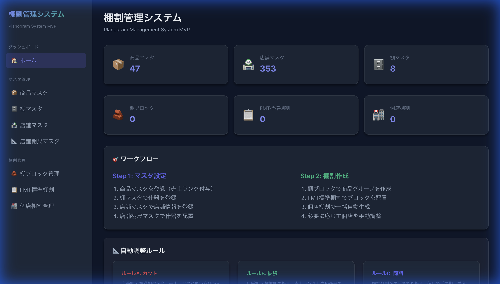
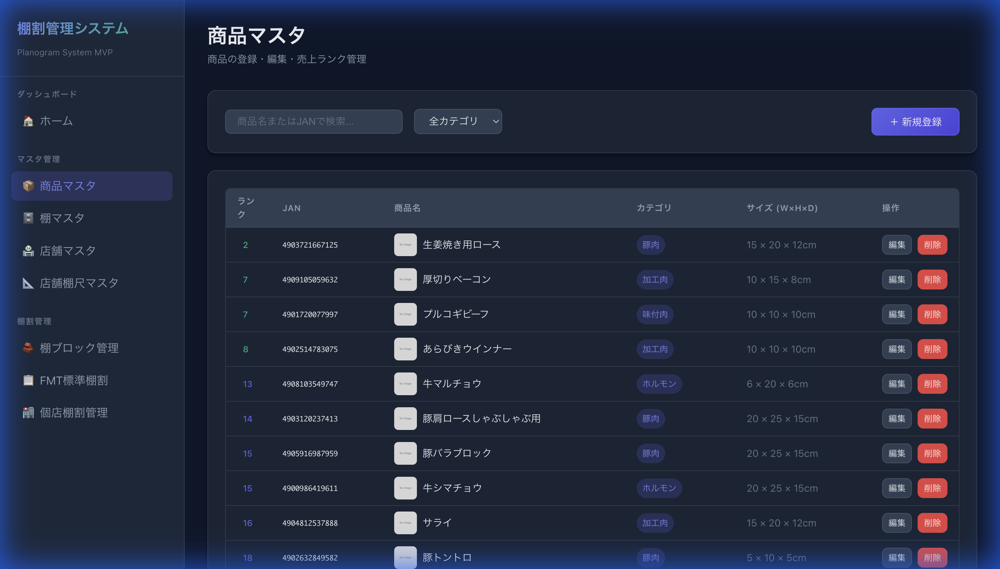
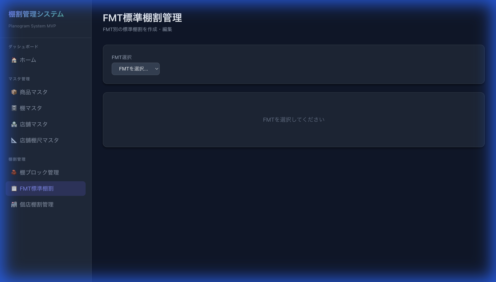
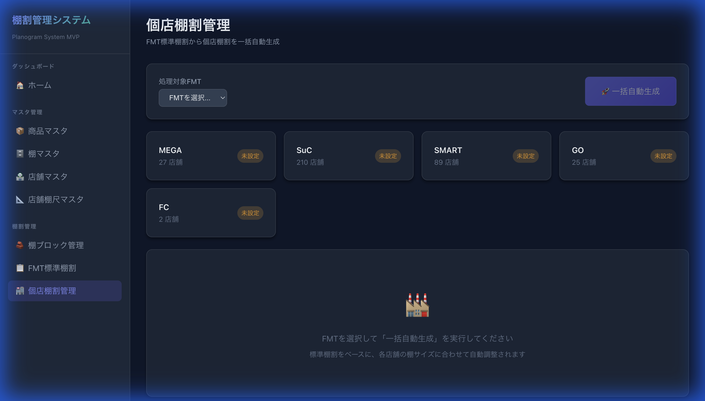
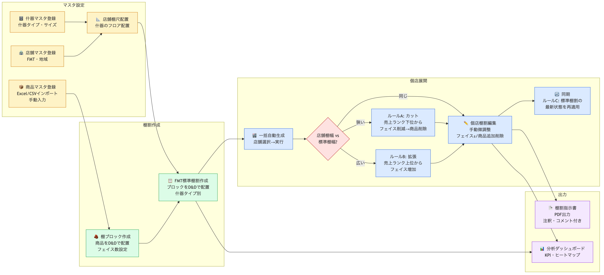

# 画面遷移図 (Visual Screen Transition)

**作成日**: 2026-01-09
**最終更新日**: 2026-03-13
**プロジェクト**: 棚割管理システム (Planogram System)

本ドキュメントは、実際のアプリケーション画面キャプチャを用いて画面遷移と機能フローを可視化したものである。

## 1. 全体遷移図 (Overview)

## 2. ルーティング一覧

| パス | コンポーネント | 画面名 |
|------|----------------|--------|
| `/` | `HomePage` | ホーム・統計・初期化 |
| `/dashboard` | `Dashboard` | KPI分析ダッシュボード |
| `/analytics` | `Analytics` | 詳細分析（ヒートマップ） |
| `/masters/products` | `ProductMaster` | 商品マスタCRUD |
| `/masters/hierarchy` | `ProductHierarchyMaster` | 商品階層管理 |
| `/masters/fixtures` | `FixtureMaster` | 棚什器管理 |
| `/masters/stores` | `StoreMaster` | 店舗管理 |
| `/masters/store-fixtures` | `StoreFixtureMaster` | 店舗棚尺配置 |
| `/blocks` | `ShelfBlockEditor` | 棚ブロック作成 |
| `/planogram/standard` | `StandardPlanogramEditor` | FMT標準棚割 |
| `/planogram/store` | `StorePlanogramBatch` | 個店棚割一括生成 |
| `/planogram/store/:storeId` | `StorePlanogramEditor` | 個店棚割編集 |
| `/instruction-sheet` | `InstructionSheet` | 指示書生成 |
| `/bulk-delete` | `BulkDelete` | データ一括削除 |

## 3. 画面詳細と遷移フロー (Screen Details)

### 3.1 ホーム画面 (Home / Dashboard)
システムへの入口。現在のマスタ登録状況や棚割作成状況がダッシュボードとして表示される。

*   **遷移先**:
    *   マスタ管理 (商品、商品階層、店舗、什器、店舗棚尺)
    *   FMT標準棚割管理
    *   個店棚割管理
    *   分析ダッシュボード / 詳細分析
    *   棚割指示書

---

### 3.2 マスタ管理 (Master Management)
商品、商品階層、店舗、什器、店舗棚尺の基礎データを管理する。

#### 商品マスタ一覧 (Product List)
登録済み商品の一覧表示。売上ランク・サイズ(mm)・JAN・カテゴリ・組織階層の確認が可能。
Excel/CSVインポート、一括編集、CSVエクスポートに対応。

---

### 3.3 標準棚割管理 (Standard Planogram)
本部が作成する「FMT（業態）」ごとの基準棚割。
棚ブロック（商品セット）をドラッグ＆ドロップで配置して作成する。
什器タイプ別タブ（多段/平台冷蔵/平台冷蔵エンド/平台冷凍/平台冷凍エンド）で管理。
カテゴリ色分け表示、商品ツールチップ（JAN・フェイス数）対応。

---

### 3.4 個店棚割管理 (Store Planogram)
各店舗に展開された棚割。
一括自動生成（Batch Generation）機能により、標準棚割と店舗サイズを元に「カット」または「拡張」ロジックが自動適用される。
カテゴリ色分け表示、商品ツールチップ、フェイス数オーバーフローチェック対応。

---

### 3.5 データフロー図

マスタ設定から棚割作成、分析・帳票出力までの全体データフロー。

